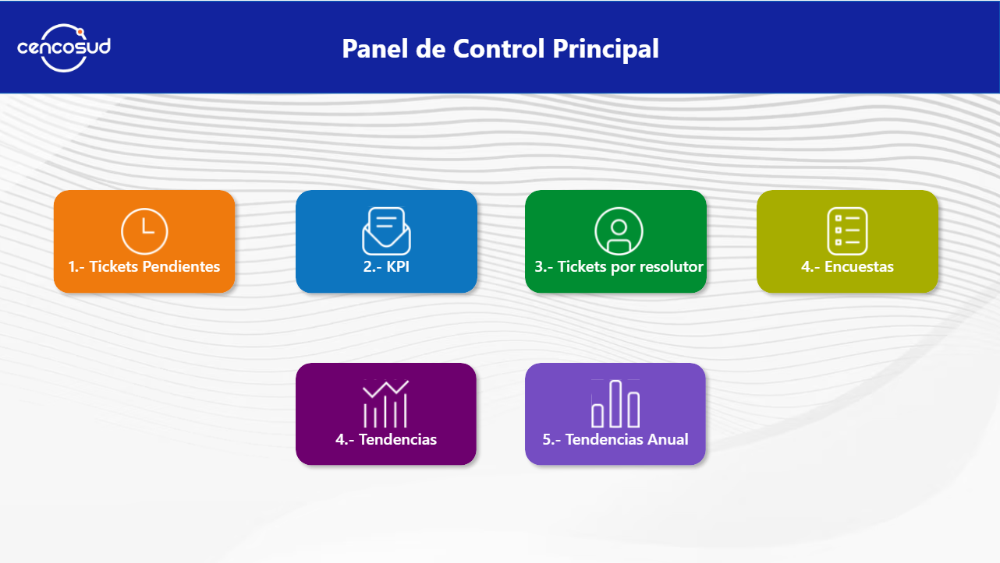
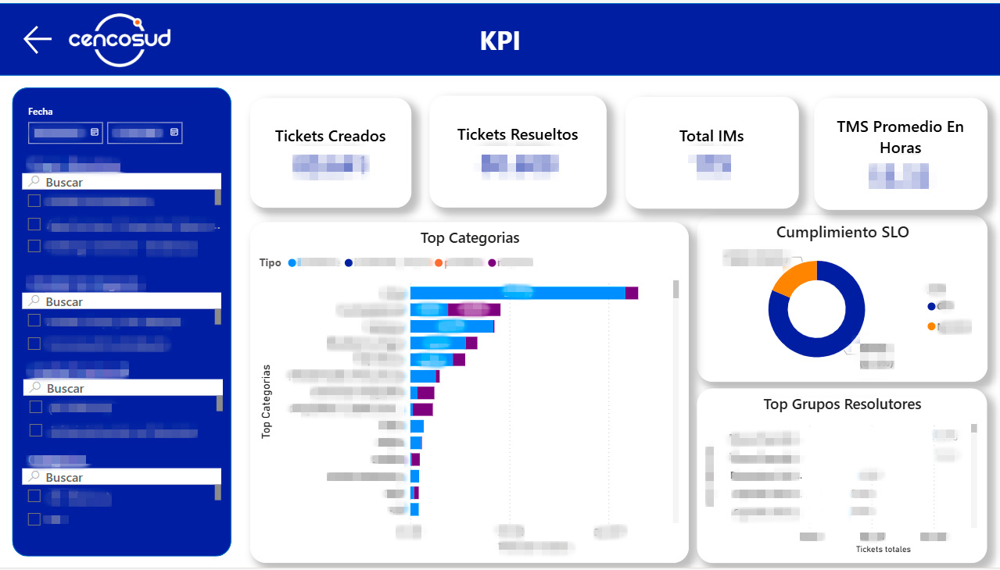
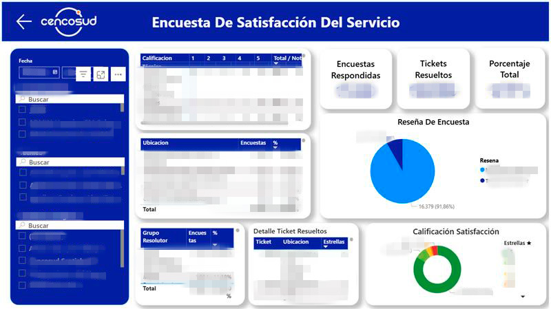
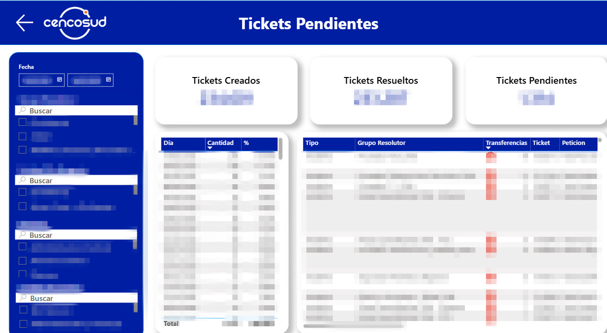
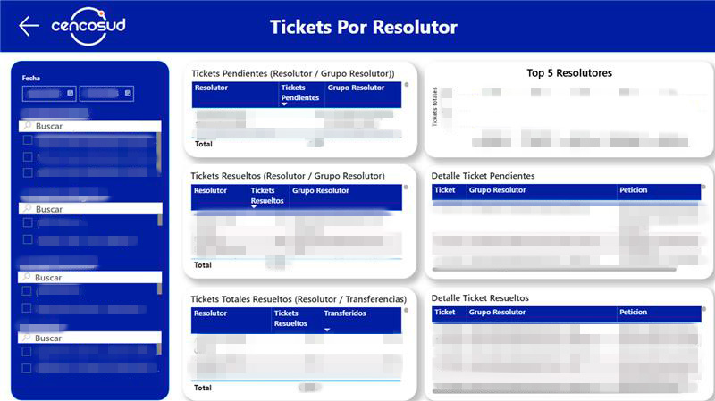
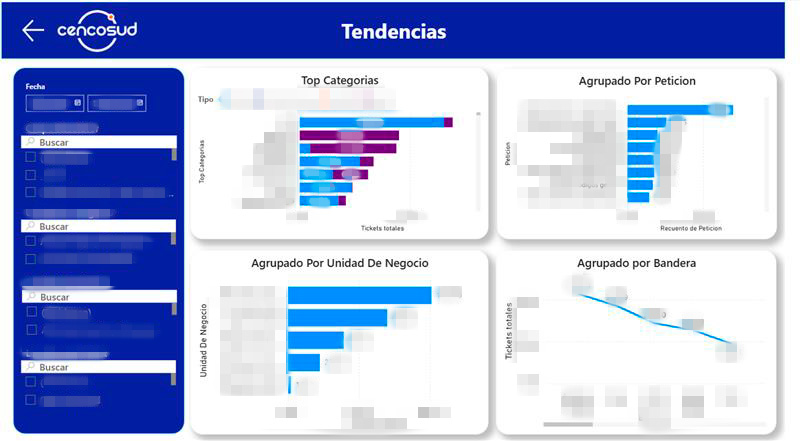
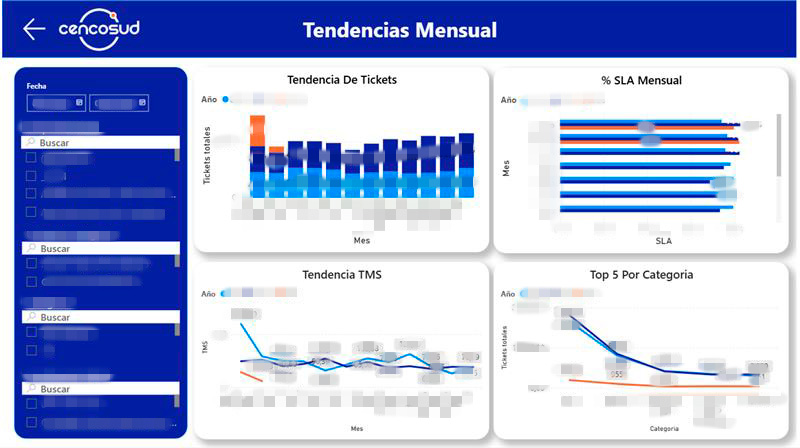
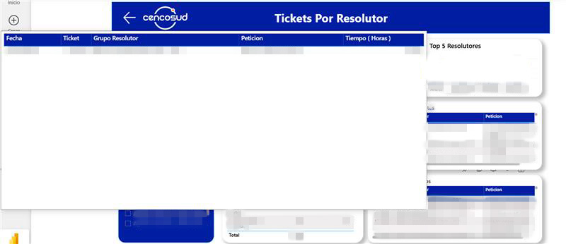
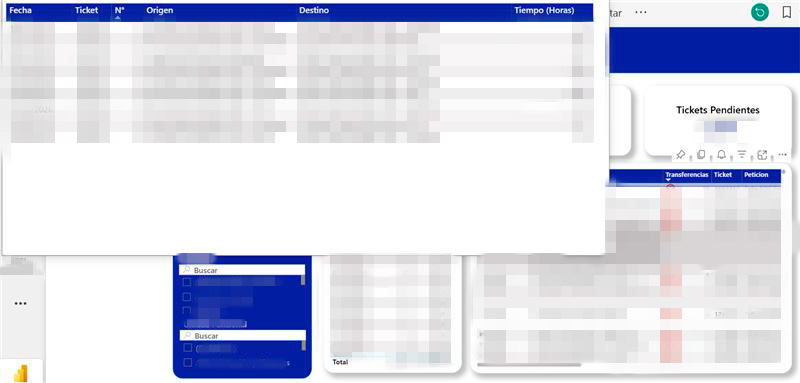

## Capturas del Dashboard

### Home – Navegación principal

Pantalla inicial del dashboard, diseñada como menú de navegación para acceder rápidamente a los distintos paneles de análisis. Permite ordenar la experiencia del usuario y separar las vistas según el tipo de información analizada.

---

### KPIs principales

Vista ejecutiva con los indicadores más relevantes para el análisis de la mesa de ayuda. Incluye tickets creados totales, tickets resueltos, total de incidentes mayores y TMS promedio en horas. Además, incorpora visualizaciones como top de categorías de incidentes, cumplimiento SLO y ranking de grupos resolutores.

---

### Encuestas de satisfacción

Panel orientado al análisis de encuestas realizadas por usuarios luego de la resolución de sus incidentes. Considera una escala de evaluación de 1 a 5, localización de reseñas por local o unidad de negocio, como Jumbo, Easy, entre otros, y análisis de resolutores con mayor o menor cantidad de reseñas junto a su respectiva puntuación promedio.

---

### Tickets pendientes

Vista enfocada en el seguimiento de tickets pendientes a la fecha actual o a fechas anteriores. Incluye información relevante para identificar casos abiertos, tipo de falla y cantidad de transferencias asociadas al ticket. Además, incorpora tooltip de detalle para analizar el historial de transferencias entre grupos resolutores.

---

### Tickets por resolutor

Panel enfocado en el análisis del desempeño de resolutores o grupos resolutores. Permite visualizar la distribución de tickets asociados a cada resolutor, facilitando la identificación de carga operativa, participación en la resolución de incidentes y posibles concentraciones de trabajo.

---

### Tendencias generales

Vista de análisis de tendencias orientada a identificar las categorías con mayor cantidad de tickets. La información se agrupa por tipo de petición, unidad de negocio, como tiendas por departamento, y bandera o marca, como Easy, Jumbo, entre otras. Esta vista permite detectar patrones de demanda y áreas con mayor volumen de incidencias.

---

### Tendencias mensuales

Panel de análisis temporal que muestra la evolución de tickets por año y mes. Incluye tendencia mensual de tickets, porcentaje de cumplimiento SLA, TMS mensual y top 5 de categorías por año. Esta vista permite evaluar comportamiento histórico, variaciones de volumen y desempeño operativo en el tiempo.

---

### Tooltip detalle de ticket por resolutor

Tooltip diseñado para entregar mayor detalle sobre un ticket específico asociado a un resolutor. Permite complementar el análisis principal sin sobrecargar la vista general, mostrando información contextual relevante del caso seleccionado.

---

### Tooltip de transferencias

Tooltip orientado al análisis del historial de transferencias de un ticket. Muestra información como grupo origen, grupo destino, tiempo activo al momento de la transferencia y detalle del flujo entre áreas resolutoras. Esta funcionalidad permite entender mejor la trazabilidad del ticket y detectar posibles derivaciones excesivas o cuellos de botella.
